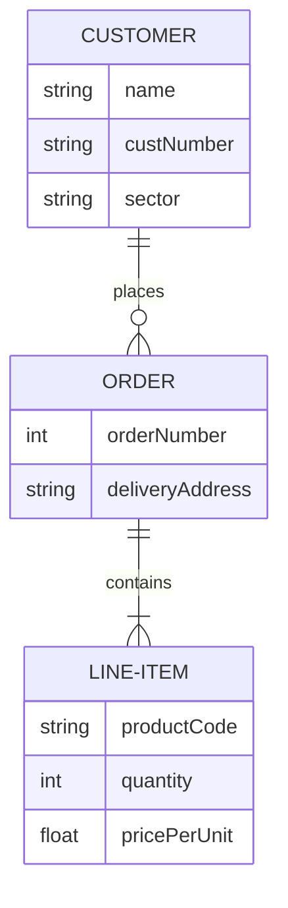

# 📘 データベース設計書

---

## 0. 基本情報

| 項目           | 内容         |
|----------------|--------------|
| システム名     | Selflow      |
| データベース名 | task_db      |
| DB種別         | MariaDB 10.5 |
| ホスト名       | localhost    |
| ポート番号     | 3306         |
| ユーザー名     | root         |
| 接続方法       | TCP/IP       |

---

## 1. ER図



---

## 2. テーブル一覧

| テーブル名 | 論理名     | 説明                     |
|------------|------------|--------------------------|
| users      | ユーザー   | ユーザー情報             |
| tasks      | タスク     | ユーザーに紐づくタスク群 |

---

## 3. テーブル定義

### 🧾 tasks（タスクテーブル）

| カラム名     | データ型     | NOT NULL | 主キー | デフォルト         | 説明                     |
|--------------|--------------|----------|--------|--------------------|--------------------------|
| id           | INT          | YES      | YES    | AUTO_INCREMENT     | タスクID                 |
| user_id      | INT          | YES      |        |                    | 紐づくユーザーID（外部キー） |
| title        | VARCHAR(100) | YES      |        |                    | タスク名                 |
| description  | TEXT         | NO       |        |                    | 詳細説明                 |
| status       | ENUM('todo', 'doing', 'done') | YES | | 'todo' | ステータス             |
| due_date     | DATE         | NO       |        | NULL               | 締切日                   |
| deleted      | BOOLEAN      | YES      |        | FALSE              | 論理削除用フラグ         |
| created_at   | DATETIME     | YES      |        | CURRENT_TIMESTAMP  | 作成日時                 |

---

### 🧾 users（ユーザーテーブル）

| カラム名     | データ型     | NOT NULL | 主キー | デフォルト         | 説明                     |
|--------------|--------------|----------|--------|--------------------|--------------------------|
| id           | INT          | YES      | YES    | AUTO_INCREMENT     | ユーザーID               |
| name         | VARCHAR(50)  | YES      |        |                    | ユーザー名               |
| email        | VARCHAR(100) | YES      | UNIQUE |                    | メールアドレス           |
| password     | VARCHAR(255) | YES      |        |                    | ハッシュ済みパスワード   |
| deleted      | BOOLEAN      | YES      |        | FALSE              | 削除フラグ               |
| created_at   | DATETIME     | YES      |        | CURRENT_TIMESTAMP  | 作成日時                 |

---

## 4. リレーション定義

| リレーション                 | 関係     | 説明                         |
|------------------------------|----------|------------------------------|
| users.id → tasks.user_id     | 1対多 (1:N) | 1ユーザーが複数のタスクを持つ |

---

## 9. テーブルのデータ例

### 📄 users（ユーザーテーブル）

| id | name      | email              | password         | deleted | created_at          |
|----|-----------|--------------------|------------------|---------|---------------------|
| 1  | 山田太郎  | taro@example.com   | hashed_abc123    | FALSE   | 2025-05-01 09:00:00 |
| 2  | 鈴木花子  | hanako@example.com | hashed_xyz789    | FALSE   | 2025-05-02 10:00:00 |
| 3  | 渡辺健    | ken@example.com    | hashed_aaa111    | TRUE    | 2025-05-03 11:00:00 |

---

### 📄 tasks（タスクテーブル）

| id | user_id | title                | description        | status | due_date   | deleted | created_at          |
|----|---------|----------------------|--------------------|--------|------------|---------|---------------------|
| 1  | 1       | 買い物               | スーパーで食材購入 | todo   | 2025-05-15 | FALSE   | 2025-05-10 09:30:00 |
| 2  | 1       | 本を読む             | 技術書1章〜3章まで | doing  | 2025-05-12 | FALSE   | 2025-05-10 10:00:00 |
| 3  | 2       | 散歩                 | 朝の運動           | done   | 2025-05-11 | FALSE   | 2025-05-10 07:00:00 |
| 4  | 3       | プロジェクト資料作成 | クライアント用     | todo   | 2025-05-20 | TRUE    | 2025-05-09 20:00:00 |

## 5. インデックス・制約

### users テーブル

- `PRIMARY KEY (id)`
- `UNIQUE (email)`

### tasks テーブル

- `PRIMARY KEY (id)`
- `FOREIGN KEY (user_id) REFERENCES users(id)`

---

## 6. 論理削除フラグについて

- `deleted` カラムを全テーブルに追加し、削除処理は論理削除で対応します。
- 削除状態のレコードは `deleted = TRUE`。
- 有効なデータ取得時は `WHERE deleted = FALSE` を条件に含める。

---

## 7. クエリ文の例

### INSERT

```sql
INSERT INTO users (name, email, password)
VALUES ('山田太郎', 'taro@example.com', 'hashedpassword');
```

### SELECT（論理削除考慮）

```sql
SELECT * FROM tasks
WHERE user_id = 1 AND deleted = FALSE
ORDER BY due_date ASC;
```

### 論理削除

```sql
UPDATE users
SET deleted = TRUE
WHERE id = 3;
```

## 8. 備考・運用ルール

パスワードはハッシュ化（bcrypt推奨）

作成・更新日時は created_at, updated_at で記録（必要なら deleted_at も）

クエリは原則 deleted = FALSE を条件に含めること

ENUMカラムはマスターテーブル化も検討可能

---